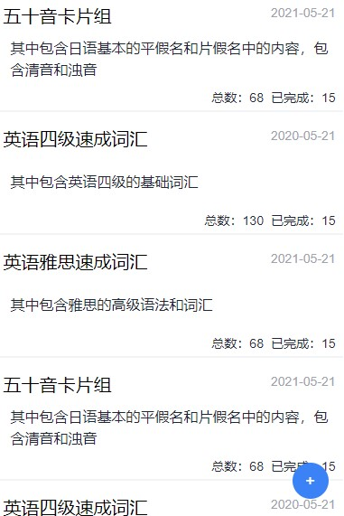

# remember-tag-web

## Project setup
```
npm install
```

### Compiles and hot-reloads for development
```
npm run serve
```

### Compiles and minifies for production
```
npm run build
```

### Lints and fixes files
```
npm run lint
```

### Customize configuration
See [Configuration Reference](https://cli.vuejs.org/config/).

### 关于本项目

本项目意在实现一个类似于 AnkiDroid 的卡片式辅助记忆工具。大体项目由两部分构成，本项目和后端项目。

本项目仅负责视图部分，数据存储部分交给本地项目。使用软件的时候，打开本地项目后，打开浏览器访问本地服务即可使用。

初步样式截图：

